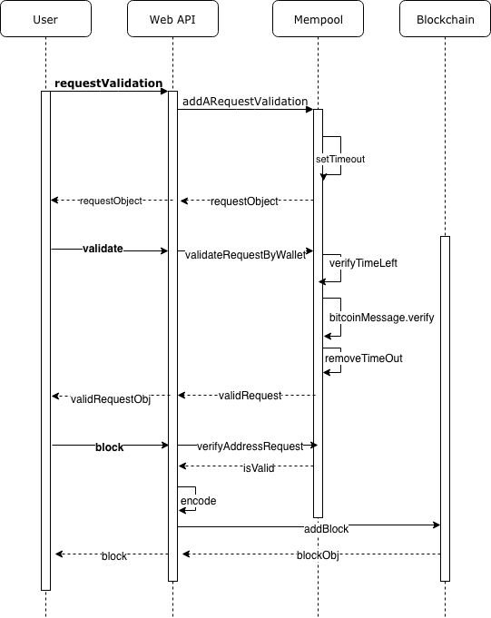

# Project #4. Build a Private Blockchain Notary Service

This is Project 4 Build a Private Blockchain Notary Service, of the Udacity Nanodegree Blockchain Developer.
In this project I used my private Blockchain, created in Project 3, to create a notarization service for digital assets.
To be able to persist my blochchain I used [LevelDB](http://leveldb.org/).

## Node.js Framework

The project uses [Express.js](https://expressjs.com/) as its framework because it is fast an minimalistic.

## Getting Started

To setup the project for review do the following:
1. Download the project.
2. Run command __npm install__ to install the project dependencies.
3. Run command __node app.js__ in the root directory.
4. The express app listens on port 8000 on localhost
5. Use the API Endpoints defined below

The following sequence diagram shows the control flow of the application.



## Blockchain ID validation routine


1. Web API `POST` endpoint to validate request with JSON response.

Use the URL for the endpoint: `http://localhost:8000/requestValidation`

```
POST /requestValidation
Host: localhost:8000
Content-Type: application/json
```

The request should have a content type `application/json` and a body that contains a bitcoin wallet address, where its private key is known:

```
{ "address":"19xaiMqayaNrn3x7AjV5cU4Mk5f5prRVpL" }
```

The response contains: `walletAddress`, `requestTimeStamp`, `message` and `validationWindow` and is returned in a JSON format:

```
{
    "walletAddress": "19xaiMqayaNrn3x7AjV5cU4Mk5f5prRVpL",
    "requestTimeStamp": "1544451269",
    "message": "19xaiMqayaNrn3x7AjV5cU4Mk5f5prRVpL:1544451269:starRegistry",
    "validationWindow": 300
}
```

The message format is defined as follows

```
[walletAddress]:[timeStamp]:starRegistry
```

A validation request is only valid for a limited time of five minutes, which is given by the validation window in seconds.

When re-submitting within validation window, the response will show a reduced validation window until it expires. 
After an existing request for a wallet address expires, a new validation request will be stored in the mempool queue.

2. Web API `POST` endpoint validates message signature with JSON response.

After posting a request validation use the URL for the endpoint [http://localhost:8000/message-signature/validate](http://localhost:8000/message-signature/validate) to validate the message from the first step.
The request should have a content type `application/json` and a body that contains the following data:

```
{
 "address":"19xaiMqayaNrn3x7AjV5cU4Mk5f5prRVpL",
 "signature":"H8K4+1MvyJo9tcr2YN2KejwvX1oqneyCH+fsUL1z1WBdWmswB9bijeFfOfMqK68kQ5RO6ZxhomoXQG3fkLaBl+Q="
}
```

The address field is the same as in the first step and the signature is created by signing the received message from the previous step with the private key corresponding to the wallet address (public key).
To obtain the signature, a bitcoin wallet like [electrum](https://electrum.org/#home) can be used.


If the request is made within five minutes the server will respond with the following json object:


```
{
    "registerStar": true,
    "status": {
        "address": "19xaiMqayaNrn3x7AjV5cU4Mk5f5prRVpL",
        "requestTimeStamp": "1544454641",
        "message": "19xaiMqayaNrn3x7AjV5cU4Mk5f5prRVpL:1544454641:starRegistry",
        "validationWindow": 193,
        "messageSignature": true
    }
}
```
If the validation succeeded, the user that made the request is granted access to register a single star.

## Star Registration Endpoint

1. Web API `POST` endpoint with JSON response that submits the Star information to be saved in the Blockchain.

Use the Url for the endpoint: `http://localhost:8000/block` 

The request should contain:

```
{
    "address": "19xaiMqayaNrn3x7AjV5cU4Mk5f5prRVpL",
    "star": {
                "dec": "68° 52' 56.9",
                "ra": "16h 29m 1.0s",
                "story": "Found star using https://www.google.com/sky/"
            }
}
```

The Star object and properties are stored within the body of the block of the Blockchain Dataset.
A star is only added to the blockchain, if the "address" that send the Star request, was validated in the previous steps.
If address is not validated, the server reponds with an error.

The successful response will look like:

```
{
    "hash": "8098c1d7f44f4513ba1e7e8ba9965e013520e3652e2db5a7d88e51d7b99c3cc8",
    "height": 1,
    "body": {
        "address": "19xaiMqayaNrn3x7AjV5cU4Mk5f5prRVpL",
        "star": {
            "ra": "16h 29m 1.0s",
            "dec": "68° 52' 56.9",
            "story": "466f756e642073746172207573696e672068747470733a2f2f7777772e676f6f676c652e636f6d2f736b792f"
        }
    },
    "time": "1544455399",
    "previousBlockHash": "639f8e4c4519759f489fc7da607054f50b212b7d8171e7717df244da2f7f2394"
}
```

## Star Lookup

1. Get Star block by hash with JSON response.

Use the URL: `http://localhost:8000/stars/hash:[HASH]`

The response includes the entire star block contents along with the addition of star story decoded to ASCII.

```
{
  "hash": "a59e9e399bc17c2db32a7a87379a8012f2c8e08dd661d7c0a6a4845d4f3ffb9f",
  "height": 1,
  "body": {
    "address": "142BDCeSGbXjWKaAnYXbMpZ6sbrSAo3DpZ",
    "star": {
      "ra": "16h 29m 1.0s",
      "dec": "-26° 29' 24.9",
      "story": "466f756e642073746172207573696e672068747470733a2f2f7777772e676f6f676c652e636f6d2f736b792f",
      "storyDecoded": "Found star using https://www.google.com/sky/"
    }
  },
  "time": "1532296234",
  "previousBlockHash": "49cce61ec3e6ae664514d5fa5722d86069cf981318fc303750ce66032d0acff3"
}
```

2. Get Star block by wallet address (blockchain identity) with JSON response.

Use the URL: `http://localhost:8000/stars/address:[ADDRESS]`

The response includes entire star block contents along with the addition of star story decoded to ASCII.

This endpoint response containes a list of stars because one wallet address can be used to register multiple stars.

Response:

```
[
  {
    "hash": "a59e9e399bc17c2db32a7a87379a8012f2c8e08dd661d7c0a6a4845d4f3ffb9f",
    "height": 1,
    "body": {
      "address": "142BDCeSGbXjWKaAnYXbMpZ6sbrSAo3DpZ",
      "star": {
        "ra": "16h 29m 1.0s",
        "dec": "-26° 29' 24.9",
        "story": "466f756e642073746172207573696e672068747470733a2f2f7777772e676f6f676c652e636f6d2f736b792f",
        "storyDecoded": "Found star using https://www.google.com/sky/"
      }
    },
    "time": "1532296234",
    "previousBlockHash": "49cce61ec3e6ae664514d5fa5722d86069cf981318fc303750ce66032d0acff3"
  },
  {
    "hash": "6ef99fc533b9725bf194c18bdf79065d64a971fa41b25f098ff4dff29ee531d0",
    "height": 2,
    "body": {
      "address": "142BDCeSGbXjWKaAnYXbMpZ6sbrSAo3DpZ",
      "star": {
        "ra": "17h 22m 13.1s",
        "dec": "-27° 14' 8.2",
        "story": "466f756e642073746172207573696e672068747470733a2f2f7777772e676f6f676c652e636f6d2f736b792f",
        "storyDecoded": "Found star using https://www.google.com/sky/"
      }
    },
    "time": "1532330848",
    "previousBlockHash": "a59e9e399bc17c2db32a7a87379a8012f2c8e08dd661d7c0a6a4845d4f3ffb9f"
  }
]
```

## Get star block by star block height with JSON response.

Use the URL: `http://localhost:8000/block/[HEIGHT]`

The response includes entire star block contents along with the addition of star story decoded to ASCII.

```
{
  "hash": "a59e9e399bc17c2db32a7a87379a8012f2c8e08dd661d7c0a6a4845d4f3ffb9f",
  "height": 1,
  "body": {
    "address": "142BDCeSGbXjWKaAnYXbMpZ6sbrSAo3DpZ",
    "star": {
      "ra": "16h 29m 1.0s",
      "dec": "-26° 29' 24.9",
      "story": "466f756e642073746172207573696e672068747470733a2f2f7777772e676f6f676c652e636f6d2f736b792f",
      "storyDecoded": "Found star using https://www.google.com/sky/"
    }
  },
  "time": "1532296234",
  "previousBlockHash": "49cce61ec3e6ae664514d5fa5722d86069cf981318fc303750ce66032d0acff3"
}
```

## API Endpoints

The web API contains a GET and a POST endpoint that respond to a request. 


### GET Block Endpoint

Get a block from the blockchain using the block height parameter: /block/:height

GET Request URL: http://localhost:8000/block/0

```
GET /block/0 HTTP/1.1
Host: localhost:8000
```


The response for the endpoint is the block in JSON format if it is available in the blockchain: 

```
{
    "hash":"49cce61ec3e6ae664514d5fa5722d86069cf981318fc303750ce66032d0acff3",
    "height":0,
    "body":"First block in the chain - Genesis block",
    "time":"1530311457",
    "previousBlockHash":""
}
```

If the height parameter is out ouf bounds, an error is sent as response.

### POST Block Endpoint

The POST endpoint allows posting a new block with the data payload option to add JSON data to
the block body. The block body should support a string of text:

```
{
      "body": "Testing block with test string data"
}
```

POST Request URL: http://localhost:8000/block

```
POST /block HTTP/1.1
Host: localhost:8000
Content-Type: application/json

{
	"body": "Insert data here"
}
```

The response for the endpoint is a block object in JSON format: 

```
{
    "hash": "50298db5739882ca8f919dfb6cee0e2a7d52affc51a56fbcd2ebf1cd0ef1477c",
    "height": 7,
    "body": "Insert data here",
    "timeStamp": "1547410581",
    "previousBlockHash": "ed81a14da1563a4f65a9f18a120583d3f2134983faf4310499111fb1a0a511a4"
}
```

### Other Endpoints and Height Error

All other endpoints are handled by a default handler that responds with a html message,
specifying the available endpoints.

If the height parameter is out of bounds, the response is an error message which gets handeled by the GET endpoint.


## Testing the project

After the server is started using `node app.js`, 
the endpoints can be tested with 
[Postman](https://www.getpostman.com/) or 
[curl](https://curl.haxx.se/) on the commandline.

The first time the server starts, it will contain only the genesis block. 
To create more blocks use the POST endpoint. All the blocks on the chain can be retrieved using the GET endpoint.

### Postman

* GET

    ```
    GET /block/0 HTTP/1.1
    Host: localhost:8000
    ```

* POST
    
    ```
    POST /block HTTP/1.1
    Host: localhost:8000
    Content-Type: application/json
    {
        "body": "Insert data here"
    }
    ```

### curl

* GET
    
    ```
    curl http://localhost:8000/block/0
    ```

* POST
    
    ```
    curl -X POST -H "Content-Type: application/json" -d '{"body":"Insert data"}' http://localhost:8000/block
    ```


## What do I learned with this Project

* I was able to create a RESTful web api with my private blockchain.
* I was able to setup a GET and POST endpoint to handle incoming client requests.
* I was able to respond on requests and handle errors such as height out of bounds.
